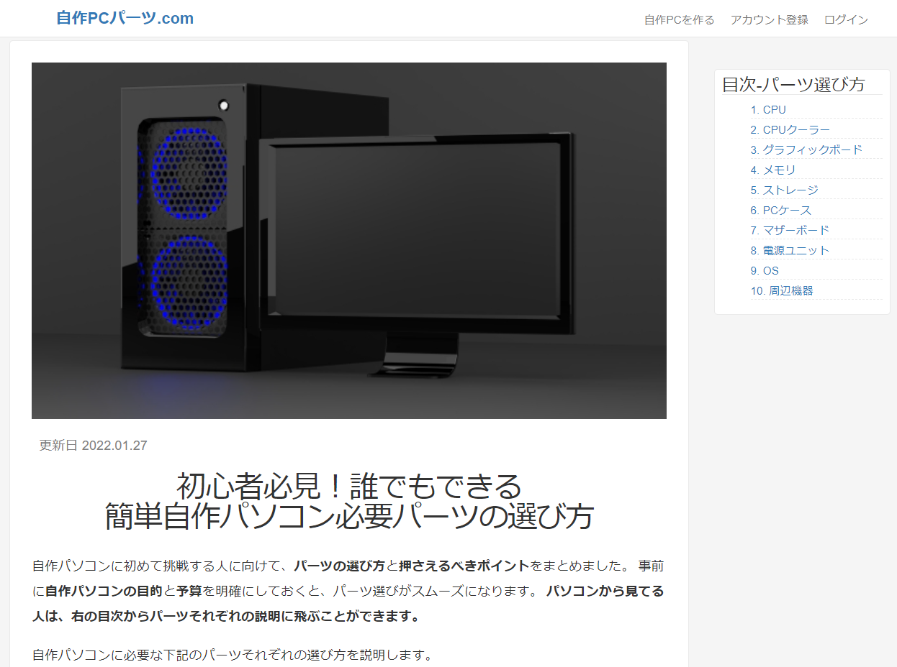

# [自作パソコン.com](https://www.jisakupc-parts.com)
自作パソコンのパーツ選びをサポートするサイトです。

　

## 機能一覧
* ユーザー登録、ログイン機能(devise)
* お問い合わせ機能
* パーツ構成保存機能
  * ログイン前後の入力情報保存機能
* 値段の自動計算機能(Ajax)
* 保存したURLのハイパーリンク化(rinku)
* ページネーション機能(will_paginate)
* 管理者機能
  * ユーザー、自作パソコン構成の削除

## 技術一覧
* Ruby 2.6.3
* Ruby on Rails 6.0.3
* Heroku
  * PostgreSQL
  * Puma
* AWS
  * EC2(開発環境)
  * S3(sitemap)
* お名前ドットコム
  * お名前メール
* Git
